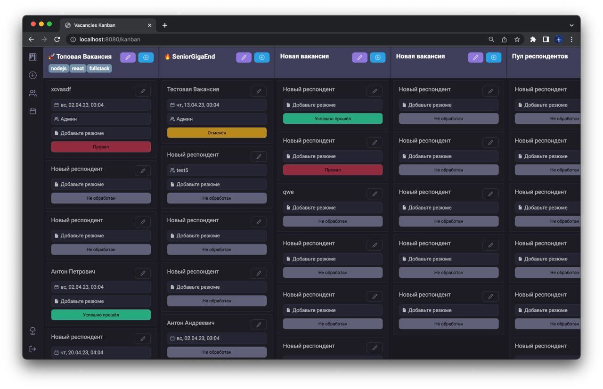

# React Typescript Boilerplate 

Данный репозиторий - фронтенд для приложения канбан доски по планированию набора людей в условную айти-компанию.

Канбан представляет из себя структуру вида колонки - вакансии, карточки - респонденты.
Приложение по большей части является результатом курса и стримов, которые провёл среди своих студентов, по вкатыванию в fullstack.

## Что исследовалось

В курсе на стороне frontend исследовались следующие пойнты: архитектура feature-sliced, исследование стейт-менеджера effector, реализация декларативного роутинга, работа с формами, react-dnd.

## Что по-хорошему доделать

Так как проект был, в основном, частью обучения студентов, которых менторю, у проекта есть ряд изъянов и вещей, которые можно улучшить:

- [ ] Сохранение темы 
- [ ] Переработать UI компоненты (есть часть компонентов, которая не относится к UI)
- [ ] Поправить сброс уведомлений
- [ ] Привести в порядок типы request-эффектов в dal
- [ ] Если канбан будет форкаться и переделываться под другие нужды - реализовать виртуализацию

## Используемые пакеты

- React 18
- Typescript 
- Webpack 5
- Babel  
- StyledComponents 
- Effector 

## Запуск dev среды 

`npm start`

## Билд

`npm run build`

## Конфигурация

- webpack.dev.config.js - dev среда
- webpack.prod.config.js - prod среда

## Команды 

- `npm run lint` Запуск eslint 
- `npm run lint:fix` Запуск фиксов eslint 

